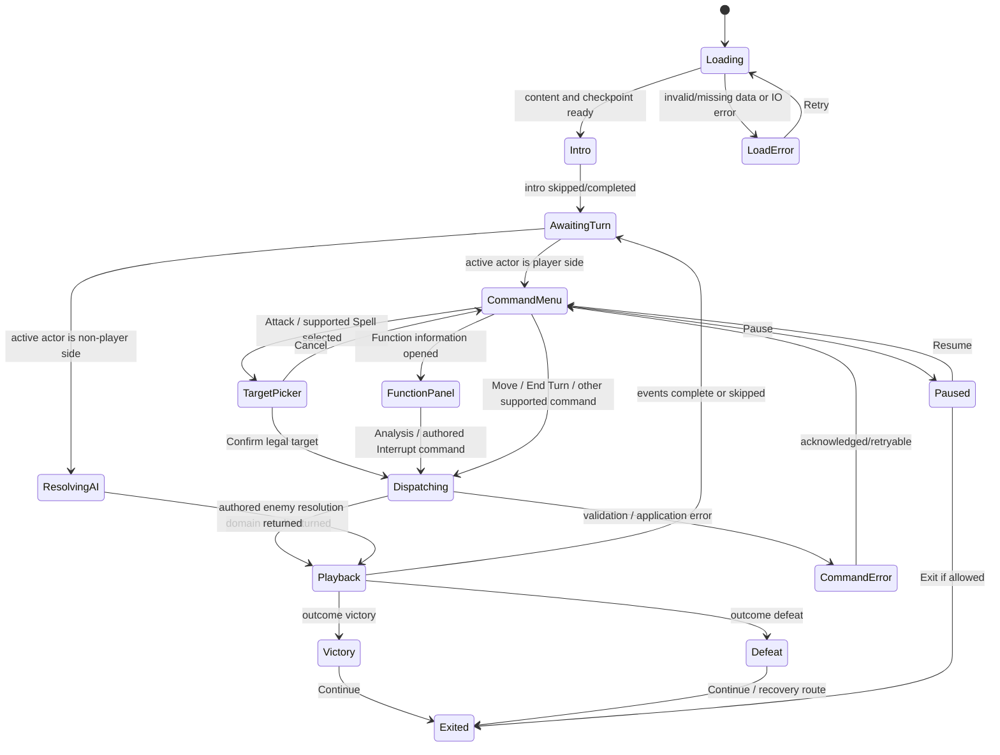

# Combat UX Flow Specification

**狀態：** Implementation-facing UX specification; combat rule changes are out of scope
**適用：** Flutter mobile battle presentation; Android first, iOS orientation behavior to verify
**依據：** `COMBAT_SYSTEM.md` v1.0、`SPELL_FUNCTION_SYSTEM.md`、`COMBAT_IMPLEMENTATION_GAP_MAP.md`、`ashfang_training_v2.json`、`astraea_combat` public API and current Ashfang screen
**目的：** 定義一套具 JRPG 回合感、手機橫向、事件驅動的戰鬥 UX，並標清現有能力和仍待決定的規則。

> 本文件只規定呈現、導覽和事件回饋，不核定新的戰鬥規則或數值。凡需要未決戰鬥語義的互動，均標示 `DECISION_REQUIRED` 或 `NOT_IN_MVP`；設計上的秒數是動畫回饋建議，不是遊戲中的回合倒數或技能施放時間。

## 1. Player goal and design principles

在每個單位的回合，玩家要能快速回答：

1. 現在輪到誰？
2. 敵人正準備做什麼？
3. 目前有哪些合法行動，選擇會花什麼已定義資源？
4. Function 哪些部分已知？分析或中斷會改變哪個後續節點？
5. 剛才的命令造成什麼結果？

畫面以常見 JRPG 的角色隊列、命令列、戰場演出和狀態 HUD 作骨架；Astraea 的識別點是 Function Graph 的可讀因果，不能退化為裝飾或一般「敵人弱點」圖示。

### Scope labels

- **Implemented** — 目前 domain/API 或 encounter data 已支援。
- **Spec-backed** — 規格有依據，但程式或 encounter data 尚未完成。
- **Proposal** — GDD 提案，不能視為已核准規則。
- **DECISION_REQUIRED** — 使用前需補產品/規則決策。
- **NOT_IN_MVP** — 此 MVP 暫不提供功能。

## 2. UX scope inventory

| 功能 | 依據/目前狀態 | UI 處理 |
|---|---|---|
| 單位 HP、Mana、condition、active actor、round、initiative order | **Implemented**：CombatState/CombatantState；Ashfang JSON 有示範資料 | 顯示實際 state，不從角色訓練或外部 profile 即時計算新的戰鬥數值 |
| Attack、CastSpell、Move、EndTurn | **Implemented**：純 Dart CombatCommand / CombatEngine | 呈現為依遭遇資料啟用的命令；引擎為命令合法性與解析權威 |
| Main Action、Movement、Reaction | **Spec-backed**；Main Action/Movement 有部分 reducer 支援；通用 Reaction window 未完成 | 不以 UI timer 製造 Reaction 窗口；Movement/Reaction 按 encounter/API 可用性啟用 |
| 命中、自然 1、自然 20 critical、傷害、擊敗、勝敗 | **Implemented**：事件包含 `hit`、`miss`、`criticalHit`、`defeated` 等 | 等解析結果事件到達後再演出和更新 log/HUD；不先猜成功結果 |
| Spell Card 與六張 Prepared Deck | **Spec-backed**：Deck 頁與 spell 名稱 pool 已存在；spell pool 標示 proposal content；沒有戰鬥成本/效果資料 | 卡片 drawer 可列出已準備卡，但缺戰鬥定義時 disabled，標示「尚無戰鬥資料」；不以卡名推測可施放效果 |
| Function Graph、Analysis、Weak Node、Interrupt | **Implemented**：Graph/runtime 支援 node、edge、knowledge reveal、interrupt/downstream cancel；Ashfang 有 authored rule | graph 狀態由 domain/runtime 驅動；資訊可見性依 encounter data；不額外揭露隱藏情報 |
| Inventory / combat items | **NOT_IN_MVP / DECISION_REQUIRED**：repo 無 combat item inventory/domain/effect command | 保留 disabled「道具｜此版本未開放」按鈕或列項並提供原因，不開啟假的道具清單、不顯示假道具或效果 |
| 多個我方角色與 Boss 的 turn queue | **Spec-backed**：battle state 支援 initiative order/多 combatants；Ashfang data 只有一名 Hero、一名 Ashfang；party 節奏未完整核准 | timeline 完全以 engine 的 initiative order 為準；不將我方角色強制分組到 Boss 前/後；同一角色 side 不代表共用或連續回合 |
| 閃避 | Attack miss 已有；獨立 dodge/evasion command/event 尚未定義 | `miss` 可播放未命中回饋；真正閃身/翻滾只在 encounter 或角色動畫明確授權時播放，否則不顯示「閃避」字樣 |
| Battle reward | 此 Ashfang encounter 無 reward block | 勝利頁只顯示戰鬥結果/繼續劇情；獎勵無資料即不顯示或標「本 encounter 未設定」，不可由 UX 新增獎勵 |

## 3. Battle route, orientation, and landscape layout

### Orientation requirement

依產品需求，戰鬥 route **不得以 portrait 作為可操作畫面**。進入 `/battle/:encounterId` 時要求 Android/iOS 使用 landscape orientation，離開 route 後恢復 App 的一般 orientation 設定。裝置實際仍回報 portrait 時，顯示整畫面「請旋轉裝置至橫向」遮罩並停用操作；不把核心按鈕擠進 portrait 版面。

實作需集中在 route/lifecycle integration，不由多個 Widget 個別呼叫平台方向 API。`SystemChrome.setPreferredOrientations`、route 進出、重建/熱啟動與 iOS 裝置方向行為要由 Flutter integration test 和實機驗證。平板可以維持 landscape layout；此 spec 不要求鎖定裝置整個 App 的 portrait 行為。

### Safe-area and visual hierarchy

橫向畫面資訊優先順序：

```text
┌────────────────────────────────────────────────────────────────┐
│ Safe top: Round / Turn timeline / Pause                         │  約 10–14% 高
├────────────────────────────────────────────────────────────────┤
│                                                                │
│                Battlefield stage / characters                  │  約 52–60% 高
│        enemy intent + optional Function Graph overlay          │
│                                                                │
├────────────────────────────────────────────────────────────────┤
│ Active unit status       Command rail / current sub-screen      │  約 26–32% 高
└────────────────────────────────────────────────────────────────┘
```

百分比是初始 layout guide，不是硬性螢幕尺寸。以 `SafeArea` 避免瀏海、圓角、狀態列與手勢區；將 system bars 設為符合 immersive battle 的樣式但保留 OS back/accessibility 可用性。命令觸控區需達專案行動端觸控標準，縮放文字時可垂直擴展 command area，必要時讓卡片列表橫向滑動。

分區：

- **BattleHeader / TurnTimeline**：頂緣顯示 round、依序排列的 combatant portrait/名字/狀態、active ring/文字標籤、Pause。timeline 可橫向捲動，active actor 置中或自動捲入可視區。
- **BattlefieldStage**：最大視覺面積，背景場景、單位立繪/sprite、施法/武器演出。使用 battlefield anchor positions 做舞台構圖，不推導距離或命中規則。敵方 intent 放敵人附近但不遮住角色。
- **UnitStatusRail**：我方每名 combatant 的 portrait/name/HP/Mana/condition，active actor 有明顯框與「現在行動」label。Boss HP 狀態放敵人名稱旁或上方。UI 不應只以紅/綠顏色傳遞存活/active。
- **CommandRail**：當前角色的主要 command menu 和目前打開的選單；保持在底部安全區，可容納手指觸控。Attack / Spell / Analyze / Move / Item / End Turn 的顯示由 encounter 支援狀態控制。
- **FunctionPanel**：Graph overlay 或 stage 旁側 drawer；打開後仍看得到敵人姿態、當前 node 和我方狀態。窄螢幕採橫向 drawer/tab，不永久覆蓋整個舞台。
- **CombatLog**：底部小型最近事件 strip（最近 1–2 項）；完整 log 由可展開 drawer 存取。log 使用明確語句，例如「LockTarget 中斷；Pounce 已取消」，避免只輸出內部 event code。

### Baseline landscape wireframe (phone)

```text
┌──────────────────────────────────────────────────────────────────┐
│ 回合 2  [Mio] [Hero ●] [Ashfang]                         [暫停] │
├──────────────────────────────────────────────────────────────────┤
│  敵方 Ashfang / HP bar             敵方意圖：正在鎖定目標        │
│                                                                  │
│      [Ashfang animation anchor]       [Hero / Ally anchors]       │
│      Function node overlay: Detect → Lock → Pounce               │
│      (未知節點依 encounter visibility 呈現；弱節點需已揭露)       │
├──────────────────────┬───────────────────────────────────────────┤
│ [Portrait] Hero       │ [攻擊] [Spell Cards] [分析] [移動]       │
│ HP 24/24   MP 12/12  │ [道具 - 未開放]              [結束回合] │
│ Active / Main Action  │ 最近：Ashfang 正在準備一個 Function       │
└──────────────────────┴───────────────────────────────────────────┘
```

文字和布局依 locale、screen width、party 人數伸縮。數值僅在對應 encounter state 已載入時顯示；上圖數值只是示例，不是通用預設。

## 4. Complete interaction order

### 4.1 Enter encounter

1. Battle route 被開啟；要求 landscape orientation。
2. 載入 encounter definition、combatant/party data、deck（若該 encounter 提供）、既有 battle checkpoint 和 content version。
3. 驗證載入內容；如 checkpoint content version 不一致，交由 application/persistence policy 處理，畫面不可自行拼接舊/new state。
4. 呈現 0.5–1.5 秒場景 establishing shot 和 encounter title；提供 Skip。此時間只屬演出，不是玩家被鎖定的遊戲倒數。
5. 依 domain `initiativeOrder` 呈現 timeline；依 domain `activeCombatantId` 標出第一位角色。不可由 UI 假定 Hero 先行。
6. 顯示 active combatant 的命令選單。若 encounter 沒有該命令所需的資料或 API 支援，顯示 disabled reason 或隱藏；每個 command 狀態須一致地解釋。

### 4.2 Resolve each combatant turn

1. Timeline 高亮目前 actor，stage 播放輪到該角色的短入場/待機姿勢，HUD 顯示 HP/Mana/condition/行動可用性。
2. 玩家可以開啟選單、查看可用資訊、選擇已支援的命令。每次選擇先過本地 presentation validation（資料存在、目標存在、場景可選），再派給 application/domain。最後合法性以 engine 為準。
3. Movement 與 Main Action 依規格可以彈性排序；只有 encounter/API 已支援時才啟用。**Quick Action 不出現在 MVP command rail**，除非規則/command API 核准及完成。
4. Domain Resolution 完成後，將 immutable result state 和 ordered events 套至 UI。播完事件後依新 `activeCombatantId` 重繪 HUD/timeline，或依 encounter coordinator 要求展示 enemy Function interaction window。
5. 玩家明確選擇「結束回合」才 dispatch `EndTurnCommand`；禁用重複觸控。不要因動畫結束、選單關閉或閒置自動結束玩家回合。
6. 非玩家單位回合由 encounter/application coordinator 執行。敵人行動不得要求玩家點「Resolve enemy attack」來代替 AI；若 enemy command/AI 未定義，停止於可理解的待決狀態，列 `DECISION_REQUIRED`，不要隨機生成攻擊。
7. 若 battle outcome 是 victory/defeat，改進終局流程，不再呈現可用戰鬥 command。

### 4.3 Weapon attack

1. 玩家點 **攻擊**；CommandRail 切換為目標選擇態。合法敵方單位取得 selection outline，顯示名稱/目前已知 intent。無合法 target 時顯示說明並禁用 Confirm。
2. 玩家點目標後，在確認列顯示 `使用目前裝備武器攻擊 <目標>` 和 encounter 提供的攻擊/傷害摘要（若有且批准顯示）。不顯示未算出的命中百分比、預言骰值或未核准的傷害公式。
3. `確認攻擊` dispatch `AttackCommand(actorId, targetId, damage, criticalDamage)`，實際參數只由 content/session adapter 傳入。Cancel 返回命令列，不消耗資源。
4. Command in-flight 時鎖定可重送命令的 controls；接收 resolution 後按 `attackResolved` → `hit`/`miss`/`criticalHit` → `defeated` 的事件序列演出。
5. HUD 依 final `CombatState` 顯示正確 HP，log 顯示結果和實際傷害 event value；若 event data 沒提供受傷原因，不自行解釋成防禦/格擋。

### 4.4 Spell Card selection, preview, and target

1. 玩家點 **Spell Cards**，打開 Prepared Deck drawer。顯示 deck 中全部已載入的卡；不抽牌、不改 deck 順序。
2. 卡片 front 顯示 title/art/role 標籤；詳情層顯示 content 已提供的 Mana cost、targeting、effect、Function Graph、method、conditions/cooldown。不存在欄位則顯示「未提供」，不推定 0 cost 或效果。
3. 當 `CastSpellCommand` 可用且 spell-to-command mapping/content 成熟時，先選卡再選合法 target；preview 只展示確定的資源扣款和 authored effects，不展示未核准 hit chance 或 forecast formula。
4. Confirm dispatch `CastSpellCommand(actorId, targetId, manaCost, damage, criticalDamage)`（目前 API 對應的欄位）；遇 insufficient Mana/invalid target 由 domain/app state 呈現明確錯誤，不扣費或播命中動畫。
5. 若 spell pool 僅有名稱/role（目前 `mvp_pool_v1.json` 狀態 `prototype-content-names-from-MVP-proposal`），卡片仍可讀取 deck 選取，但全部 combat casts 顯示 disabled「尚未設定戰鬥效果」。不能自行用 role 推導傷害、Buff、成本或 Weak Node 能力。

### 4.5 Function Analysis, Weak Node, and Interrupt

1. 當 encounter/session 提供有效 Active Function 時，EnemyIntentCard 展示該 function 的 authored intent/timing information；不要用固定 countdown 倒數，除非 content 有真正的遊戲規則支援。
2. FunctionPanel 依 knowledge/visibility 展示 Graph：已知節點以名稱/狀態呈現；未知節點用 `???` 或隱藏節點；Weak Node 標記須等 runtime 回傳 reveal 後才加。節點狀態以 label/icon/shape+連線共同表達，不只紅/綠色。
3. 玩家按 **分析 Function** dispatch FunctionRuntime `analyze(graph, nodeId, analysisRoll, analysisModifier, difficulty, knowledge, rules)`；production caller 的隨機 roll 必須來自 deterministic engine/session RNG，不得 UI 自行產骰。操作的 action/reaction cost 未定者依 encounter/current adapter 行為標示待決，不靠 UI 暗中扣 action。
4. Analysis 成功：更新已知 state、突出該 node 與依賴路徑，log 說明「已分析 LockTarget；其後續連線為 Pounce」。只有已 authored weak-node semantics 足夠時才明確說「中斷會取消 Pounce」。失敗：顯示「未能確認節點依賴」而不假裝 Graph 已改變。
5. Interrupt 按鈕只在 FunctionRuntime/API 回報 active function active node、已揭露知識、node interruptible、有效 authored rule 時啟用；符合性以 engine 為權威，不由 UI 推測。
6. 玩家確認 Interrupt 後呼叫 runtime 的 `interrupt(...)` 或已建立的 session command；成功時在 Graph 顯示 LockTarget `Interrupted`、Pounce `Cancelled`，feedback 說清楚「中斷 LockTarget，取消下游 Pounce」。失敗只顯示 domain result，不播成功特效。
7. Function analysis/interrupt 現時並非通用 `CombatCommand`；Flutter 應由 battle application/controller 封裝成單一 dispatch 和 presentation events。純 Widget 不直接修改 FunctionKnowledge 或 ActiveFunctionState。

### 4.6 Movement, items, end turn

- **Movement**：以 encounter 提供的 zones/legality 展示選擇；選擇後 dispatch `MoveCommand(actorId, destination)`，收到 `moved` event 再移動舞台單位和更新狀態。現有 API 只拒絕空值或原 zone，合法 zone/距離/每回合次數尚未定義；未有 authored zone model 時 command disabled，標 `DECISION_REQUIRED`。
- **Items**：MVP 顯示灰階 `道具（未開放）`、鎖頭圖示和 semantics reason「此版本沒有戰鬥道具資料」。不 clickable，不佔用選單流程，不假裝空 inventory 等同可以使用道具。若產品要正式開放道具，需 item domain、content schema、合法效果、目標/消耗和持久化決策。
- **End turn**：command rail 顯示明確 `結束回合`。Confirm dispatch `EndTurnCommand(actorId)`。事件到達後 timeline 移動到 engine 指定的下一個 active actor；若已進下一 round，round HUD 更新。UI 不手動猜隊列或 round boundary。

## 5. Per-character command menu

每個 active actor 使用相同位置的 CommandRail；可按 content/role 隱藏不適用項目，但不可由 display name 判斷角色技能。

| Command | 顯示/啟用條件 | 操作 | Domain contract / UI 回饋 |
|---|---|---|---|
| Attack | actor active、Main Action 可用、至少一個敵方 target | target → preview → confirm/cancel | `AttackCommand` → attack/hit/miss/critical/defeated events |
| Spell Cards | deck 有 cards；有戰鬥 definition/API 才可施放 | all prepared cards → details → target → confirm | `CastSpellCommand`；cost/effect 只來自 content；無戰鬥資料則 disabled |
| Analyze Function | encounter 有 active function，且 runtime 有有效可分析 node | node/intent → Analyze → result | FunctionRuntime analyze/session API；成功更新 knowledge event/state |
| Move | encounter 有可選 authored destination 且移動已啟用 | destination → confirm/cancel | `MoveCommand` → moved event；range/limit TBD means disabled unless authored |
| Items | 永遠在 current MVP disabled | 無 action；顯示 disabled reason | `NOT_IN_MVP`，沒有 item command/domain |
| End Turn | battle active、此 actor 為當前 actor | confirm/dispatch | `EndTurnCommand` → turnEnded and domain active actor |
| Function Interrupt | 只在有效 Function window/contextual action area 顯示 | node → Interrupt → result | FunctionRuntime interrupt/session command；success result must contain authored cancelled nodes |
| Quick Action / Guard / Dodge / Run | 未定義完整通用規則/API | 不顯示為可用 command | `DECISION_REQUIRED` / `NOT_IN_MVP` |

`Analyze Function` and `Function Interrupt` may appear as contextual action buttons in the FunctionPanel rather than permanent items, keeping the general command menu compact. Whether they use a Main Action, Reaction, or other cost must be resolved by rule/content; visual placement does not imply action cost.

## 6. Command and state model

### Widget responsibility map

```text
CombatRouteScreen
└── CombatSessionController (application adapter; one command owner)
    ├── BattleHeader
    │   ├── RoundLabel
    │   ├── TurnTimeline
    │   └── BattlePauseButton
    ├── BattlefieldStage
    │   ├── EnvironmentBackground
    │   ├── CombatantActorLayer
    │   ├── EnemyIntentCard
    │   └── FunctionGraphPanel / FunctionInspector
    ├── PartyStatusRail
    ├── CombatLogStrip / CombatLogDrawer
    ├── CommandRail
    │   ├── CombatCommandMenu
    │   ├── TargetPicker
    │   ├── PreparedSpellDrawer
    │   └── DisabledItemsEntry
    ├── CommandPlaybackOverlay (presentation only)
    ├── BattlePauseSheet
    └── BattleResultScreen
```

`CombatRouteScreen` watches app-level immutable state. `CombatSessionController` is the only presentation/application dispatch boundary. The pure Dart engine remains authoritative and has no Flutter dependency.

### Commands/events contract

Current public core API observed:

```text
CombatEngine.resolve(CombatState, CombatCommand) → CombatResolution(state, events)
CombatCommand: AttackCommand | CastSpellCommand | MoveCommand | EndTurnCommand
CombatEvent: type, actorId, optional targetId, optional value
FunctionRuntimeEngine.analyze(...) → FunctionAnalysisResult
FunctionRuntimeEngine.interrupt(...) → FunctionInterruptResult
FunctionRuntimeEngine.resolveNext(...) → ActiveFunctionState
```

UI must bind to command/result state rather than directly manipulating units. Existing combat events include:

```text
attackResolved (value is attack roll)
hit | miss | criticalHit (value is resolved damage)
guardReaction
defeated
moved
turnEnded
```

Map event types to localization keys and animation recipes in presentation. Do not make English event strings or internal type names the player-facing text. Function runtime currently returns state/result objects rather than a normalized event list; app-level adapter may build an immutable presentation playback record from those **actual** before/after results. It must not synthesize rule effects.

### Presentation state machine



This is a **presentation state machine**, not an added combat phase machine. If the engine says state remains active while function panel is open, UI must retain the authoritative combat state and use an application-owned screen mode only. `ResolvingAI` behavior requires authored encounter logic; it cannot be fabricated by widgets.

## 7. Sub-screen wireframes

### 7.1 Target picker

```text
┌────────────────────────────── Stage ────────────────────────────┐
│  [Ashfang ◉ selected]             [Hero]                         │
│                                                                  │
├──────────────────────────────────────────────────────────────────┤
│ 選擇攻擊目標                                  [取消] [確認攻擊] │
│ Ashfang · HP 16/16 · 敵方                                       │
└──────────────────────────────────────────────────────────────────┘
```

Selection outline + text/semantics. Confirm stays disabled until an engine-legal target is selected. Selecting an ally/defeated entity cannot dispatch an attack.

### 7.2 Prepared Spell drawer

```text
┌────────────────────────────── Stage ────────────────────────────┐
│                                                                  │
├──────────────────────────────────────────────────────────────────┤
│ 已準備法術 (6)                                [關閉]              │
│ [Arc Bolt] [Barrier] [Weak Node Scan] ...                         │
│ ──────────────────────────────────────────────────────────────── │
│ Arc Bolt · Attack                                                │
│ Mana: 尚無戰鬥資料    目標: 尚無戰鬥資料                          │
│ 效果: 尚未設定戰鬥定義                                           │
│ [不可施放：目前 card pool 只有名稱/類型]                          │
└──────────────────────────────────────────────────────────────────┘
```

When full spell definitions are authored, replace unavailable fields with content fields; do not change this view into a random draw deck. Six is the prepared deck limit from the tutorial baseline; if an encounter has no deck, show an explicit empty state instead of assuming six cards.

### 7.3 Function inspector

```text
┌────────────────────── Ashfang Function ─────────────────────────┐
│ Intent: 正在鎖定目標                                             │
│                                                                  │
│  DetectTarget ──▶ [LockTarget / active] ──▶ Pounce               │
│                     未確認 Weak Node                             │
│                                                                  │
│ 尚未分析 · 分析可檢查目前節點                                     │
│ [分析此節點]                    [中斷 - 尚未揭露]                │
│                                                                  │
│ 分析成功後：                                                      │
│ LockTarget ──▶ Pounce (受此節點依賴；依 authored rule 可取消)    │
│ [中斷此節點]                                                     │
└──────────────────────────────────────────────────────────────────┘
```

The before/after text is a template. Show `Pounce` and dependency only if encounter visibility permits. `cancel downstream Pounce` is shown for Ashfang only after successful Analysis and because JSON authors the cancellation. Accessibility names state node name, active/interrupted/cancelled status, and relation in reading order.

### 7.4 Item placeholder

```text
[道具  🔒]
此版本尚未提供戰鬥道具。                         disabled
```

Do not open empty inventory or imply that acquiring an item changes battle. This is a quiet disabled entry, not a modal interrupting the core battle flow.

### 7.5 Victory / defeat

```text
┌────────────────────────────── Stage ────────────────────────────┐
│         [short victory/defeat pose and scene treatment]          │
│                 戰鬥勝利 / 戰鬥結束                              │
│ Ashfang Training Construct defeated / Hero is defeated            │
│ Function result: LockTarget interrupted; Pounce cancelled         │
│ 本遭遇沒有設定可顯示的獎勵                  [繼續]                │
└──────────────────────────────────────────────────────────────────┘
```

Show only outcomes/events that actually occurred. If win/loss content/reward/stats are absent, omit rather than invent. Continue route is app story/navigation behavior.

### 7.6 Pause sheet

Provide `繼續`, animation preference, audio controls only if those settings exist, and `離開戰鬥` only if abandon/resume semantics are decided. Pausing is presentation-level: do not advance rounds or stop deterministic domain resolution halfway. If battle exit is not defined, show only Continue and `離開` as `DECISION_REQUIRED`/disabled.

## 8. Scene and card animation choreography

All scene motion is a projection of domain events and current state. Durations below are visual pacing recommendations; users can skip them. No animation duration is a battle clock, action cost, or reaction window.

| Trigger/selection | Stage / card choreography | HUD / log reaction | Input policy |
|---|---|---|---|
| Route enters | Fade from prior page into arena wide shot; enemy and party actors resolve to authored stage anchors; encounter title label fades | Load state and round shown after authoritative data ready | Lock command input during load/intro; Skip intro fast-forwards visuals only |
| Active actor changes | Timeline active frame slides/brightens; active sprite/portrait changes idle pose; no forced camera pan that hides HUD | Active label/HP/Mana/status update from state; log can say `輪到 <name>` | Enable actor command controls only for current player-controlled actor |
| Menu opens / card selected | Command panel slides/fades; selected card raises/brightens; card artwork remains separate from UI text/cost/function graph | Focus state and authored cost/effect preview update | Menu tap is not domain command; Cancel returns without state mutation |
| Target selected | Selection reticle + nameplate, subtle camera/foreground focus | Target current HP/status visible | Confirm enabled only for legal target |
| `moved` event | Actor moves between authored stage anchors with short travel/ease; if no spatial-to-zone mapping, update only the authored visual | zone/status update from resolved state; log reports movement | Wait for authoritative `moved`; repeated animations do not resend MoveCommand |
| Attack command accepted, before resolution | Attacker anticipation pose; weapon trail begins but impact is held until result | Action in-flight indicator, no damage number yet | Lock repeat command; Skip cannot cancel domain resolution |
| `hit` event | Weapon/projectile impact; target brief hit recoil/flash, small camera shake only if reduced-motion off | Damage number = event damage value; HP bar animates from previous to final state; log: attack hit | Playback can be skipped to final HP |
| `miss` event | Attack motion ends without hit effect; target remains in place or returns to idle | `未命中` label; zero-damage feedback only if event/result conveys no damage | Do not label as dodge unless a separate authored dodge/evasion event exists |
| `criticalHit` event | Stronger impact highlight/VFX and brief hit-stop; no extra invented effects | `暴擊` label and event damage; HP bar final state | Reduced-motion uses instant flash/icon/text; skip applies final state |
| Incoming damage / `defeated` | Hit recoil; at 0 HP use encounter-authored defeat pose or neutral fade; avoid collapse/death depiction if tone/content disallows | HP animates to resolved value; condition label `戰敗`; log explains source only if authored | If battle terminal, suppress commands when terminal state arrives |
| Spell command accepted | Chosen card animates from drawer to caster; cast pose and authored VFX begins | Spell name and authored Mana cost transition after resolution semantics; do not deduct on speculative visual | Lock duplicate command; animation skip cannot alter cost or target |
| Spell `hit`/`miss`/`criticalHit` | Target impact choreography follows exactly same event logic as weapon with spell-specific authored VFX | Mana and HP from final state; log uses Spell display name + event | Same skip/replay rules; spell VFX asset missing -> generic clean flash |
| Function begins/progresses | Active node gains outline/edge pulse and actor telegraph pose; Pounce uses construct's authored animation if available | Enemy intent text; Graph active node/edge state; no countdown absent a mechanic | Do not unlock input windows based on animation end |
| Analysis result | Scanner/ripple traces examined node/edge; success reveals labels and relation after result; failure neutralizes scan | Log names the newly learned data; Weak Node label appears only after `revealed` state | Button lock during dispatch; no instant repeat during result playback |
| Interrupt succeeds | On event/result, active node fractures/deactivates, authored downstream Pounce nodes fade with `Cancelled` label; enemy telegraph visibly stops | Log names node and exact cancelled downstream function; intent card changes to cancelled | Skip goes directly to final runtime state; cannot interrupt by tapping a visual animation |
| Interrupt fails | Short disrupted cast / unchanged graph; no fake cancellation | Log says attempt did not interrupt; exact failure reason only if domain returns it | No automatic retry or free second attempt unless rules specify |
| Turn ended | Timeline advances to engine-selected actor; actor entrance/pose follows queue | Round, active actor, statuses from final state; event log adds turn end | Ignore double EndTurn while pending |
| Victory | Enemy defeat resolves, stage holds result pose, short scene-wide light/particle accent | Result card shows Victory and only authored function payoff/reward; log can expand | All commands disabled; Continue only |
| Defeat | Stage dims/holds authored defeat pose, avoid game over retry assumptions | Result card explains defeat based on final state; recovery CTA only if product flow exists | All commands disabled; no undocumented restart/reset |

### Animation orchestration details

- Command dispatch is one-shot. The presentation stores result event batch keyed by battle revision/command identity so widget rebuilds cannot enqueue the same events twice.
- Maintain separate `domain state` and `playback cursor`. Domain is updated by the engine first; animation replays only render that immutable result. On process resume, render final state and event summary rather than re-running random resolution.
- `Skip` moves the playback cursor to batch end and clears transient overlays; it never sends another command, consumes additional RNG, or changes a state value.
- Reduce Motion replaces camera shake, zoom, hit stop, and long transitions with quick opacity/state changes while preserving hit/miss/weak-node information.
- Audio/haptics are optional presentation feedback; never the sole signal for crit, damage, interrupt, or turn change.

## 9. Loading, empty, disabled, and error states

| State | Player-visible response | Safe behavior |
|---|---|---|
| Encounter/checkpoint loading | Darkened stage silhouette + progress indicator + `載入戰鬥…` | No commands until valid state and initiative are ready; do not show fake 0 HP |
| Empty spell deck | Spell drawer: `目前沒有已準備法術` + optional navigation link to Deck when exit flow permits | Attack/other available commands still work; no placeholder spell cast |
| Spell names exist but combat definition absent | Card details show missing combat data and disabled explanation | Do not infer cost/effect from role or art |
| No item domain/data | Disabled `道具（未開放）` with semantic disabled reason | Not a tappable empty inventory |
| No legal target | Keep target screen but show `沒有可選目標`; disable confirm, allow Cancel | Do not dispatch invalid target |
| Command unsupported for encounter | Hide or disabled with concise reason; prefer hide if permanently not in MVP | No fake success animation |
| Invalid action/domain rejection | Inline message/banner such as `此行動目前無法執行`; restore command UI from authoritative state | Keep state and event playback unchanged; do not deduct cost locally |
| Data schema/version invalid | Blocking error screen names encounter load problem + Retry/Back | Never replace missing combat data with numeric defaults |
| Persistence write fails | Non-blocking `戰鬥進度尚未儲存` banner and Retry save if repository offers it | Keep current in-memory state; do not replay last command to save again |
| Asset/animation missing | Use static character art/neutral fade, retain action log and HUD | Art loading failure does not block domain result |
| Encounter has no reward | Result text says no reward was configured or simply omits reward panel | Never display zero or invented grant as actual result |

## 10. Input locks, skip, reduced motion, save, and background/resume

### Input lock

- At most one domain command may be in-flight per battle session at a time unless the public engine/session API explicitly supports concurrent resolution (it currently does not).
- While awaiting resolution: disable command buttons/target confirmation/End Turn and show subtle progress feedback. Do not disable read-only log/Graph inspection unless controller state makes data unsafe.
- After domain result is received, command input remains locked only through relevant presentation playback; skip clears playback lock. The next command is enabled from current domain state, not from elapsed time.
- Function windows require explicit current function state and legal command enablement. Animation beginning/ending cannot create or close a domain reaction window.

### Skip / reduced motion

- Intro, command result, and victory animations are skippable. Skip means display final state immediately.
- Respect OS reduced motion where exposed and provide an in-game setting if project settings support it. Reduce camera movement, flashes, zoom, parallax, and hit-stop; preserve clear status transitions and text.
- Flash effects must be brief and avoid rapid high-contrast repeated flicker.

### Save and resume

- Current Ashfang route already saves after each `_act`; checkpoint repository exists elsewhere. UX expects successful command result to be persisted before it is treated as safely resumed, but exact transaction/guarantee belongs to persistence owner.
- Store/restore authoritative combat state, RNG state, Function state/knowledge and content version as supported by persistence schema. Resume timeline and commands from state; never replay commands from presentation animations.
- `DECISION_REQUIRED`: whether a battle can be abandoned, whether exit autosaves every selection or only resolved commands, and what to do for encounter version mismatch must be fixed by product/persistence owner before exposing a destructive exit.

### App lifecycle

- On `inactive`/`paused`, stop decorative animation and prevent user input; preserve/commit any already-resolved command result through the existing repository boundary.
- If domain command completes while app is backgrounded, resume to final HUD and a concise event log summary; don't make player wait through a long animation.
- Resume orientation lock while still in battle route. On leaving battle, restore the App orientation configuration.
- System back opens pause/exit sheet. If exit behavior lacks a decision, Continue is active and Leave is disabled with explanation rather than silently abandoning a battle.

## 11. MVP Ashfang Training Construct flow

### Authored data and current implementation facts

Encounter `assets/content/encounters/ashfang_training_v2.json`:

```text
contentVersion: ashfang-training-2
balanceStatus: illustrative-inputs-awaiting-playtest
seed: 417
combatants: player / ashfang (single each)
player: HP 24, Mana 12, attackBonus 8, defense 12, processingModifier 2,
        attackDamage 8, criticalDamage 12
Ashfang: HP 16, Mana 0, attackBonus 6, defense 12, processingModifier 0,
         pounceDamage 5, criticalDamage 8
analysisDifficulty: 12
Function: DetectTarget → LockTarget → Pounce
Weak Node rule: interrupt LockTarget cancels Pounce
```

All combat inputs are illustrative and awaiting playtest. UI must show a compact development/content status only in debug/test builds or design inspection; do not present it as game lore or claim balance approved. No spell definitions/deck selection is authored in this encounter JSON. There is no party roster, item inventory/effect, position/zone options, enemy intent visibility policy, rewards, or initiative queue in this encounter content. The current Ashfang adapter creates two combatants and hardcodes `[player, ashfang]` order.

Current screen flow in code is: Hero Attack; Hero End Turn starts Ashfang Function at DetectTarget then advances to LockTarget; Analyze Weak Node is available while LockTarget active; analysis failure resolves Pounce; success reveals Weak Node; interrupt cancels Pounce and ends Ashfang turn; Ashfang Pounce can also be manually resolved; then Hero can attack again. This is **Implemented prototype behavior**, not a generic or fully approved action-economy rule. The current Function information is shown as text; the screen does not yet contain the JRPG layout/animations specified here.

### Recommended screen flow without changing Ashfang rules

1. **Encounter intro:** landscape training arena; show Ashfang and Hero in a wide composition. Title reads `Ashfang Training Construct`. After skip/intro, show round/turn timeline only from the session state. Since JSON has no initiative roll/order field, keep the currently authored adapter order as the actual current behavior and label it internal/prototype; changing to rolled order requires content/session/API decision.
2. **Hero command phase:** show Hero HP `24/24`, Mana `12/12`, Attack `8`, End Turn. Spell Cards are disabled: the global pool only has names/roles, and this encounter supplies no cast values/targeting. Items disabled. Move hidden/disabled because no zone model/destinations are authored. Analyze Function remains in contextual Function panel only if session says an Active Function exists.
3. **Attack target:** selecting `Attack` highlights Ashfang. Confirm sends current encounter-authored attack inputs and domain resolves using seed 417. Do not show exact roll chance preview. On hit/miss/crit play event-aligned animation and update Ashfang HP `16→resolved value`; log shows actual result.
4. **End Hero turn:** dispatch EndTurn; timeline marks Ashfang active. Encounter coordinator activates `DetectTarget`, then Graph runtime moves to `LockTarget`. Stage plays target detection/lock telegraph. Show `Ashfang 正在鎖定目標` as authored/implemented intent copy, without countdown. `FunctionPanel` shows graph visibility only after explicit encounter policy is supplied. Until then, safe UI shows active node and known intent; the user can inspect details but no Weak Node badge.
5. **Analysis window:** current adapter permits `Analyze Weak Node` when `LockTarget` is active. UI offers this contextual action with clear prompt. `analysisDifficulty` is 12 and the analysis modifier comes from TrainingRepository in code; both are prototype mechanics, not UI preview values. The outcome uses deterministic session RNG and is accepted only from FunctionRuntime. Mark the question of Analysis cost/window as `DECISION_REQUIRED` before generalizing beyond Ashfang.
6. **If analysis succeeds:** highlight `LockTarget`; show `Weak Node revealed`. Explain authored relation: `LockTarget → Pounce`; interrupting `LockTarget` cancels downstream `Pounce`. Enable `Interrupt LockTarget` only if runtime returns legal/revealed state. Confirm calls `interrupt(...)`; on success stop telegraph and show node state/cancellation animation + log. Then proceed to Hero on next active turn from resulting session state.
7. **If analysis fails:** display `未能確認 LockTarget 的 Weak Node` and the current encounter adapter resolves Ashfang's Pounce; show attack/critical/miss event and damage. Current code resolves Pounce immediately after failed analysis; do not imply retry is available. Whether this immediate failure consequence and free Analysis are intended tutorial rules is `DECISION_REQUIRED` for combat designer/owner.
8. **If player chooses to resolve Pounce:** current UI exposes `Resolve Pounce`; final UX should not make an enemy action look like a player command. Encounter coordinator should resolve the authored enemy function through engine/session and animate it automatically when current phase/result says to proceed. Existing lack of enemy AI/general Function action contract is `DECISION_REQUIRED`; do not implement a generic auto-attack policy from this UX document.
9. **Next Hero turn:** the current test fixture demonstrates attack → analysis reveal → interrupt → attack, where the final attack can defeat Ashfang under fixture/seed. Update queue/HUD after each authoritative state. Victory card says `訓練遭遇完成`; do not grant reward absent content.
10. **Defeat:** if Hero reaches 0 HP from authored Pounce, show defeat result and final log. Retry/continue route remains a story/product decision; don't reset state or heal automatically.

### Ashfang graph and visibility

JSON contains the complete graph and Weak Node rule, but has no explicit `visibility` or player-knowledge policy. `COMBAT_SYSTEM.md` supports Transparent (e.g. tutorial/familiar enemy), Partial, and Hidden visibility. **DECISION_REQUIRED:** approve Ashfang as Transparent tutorial or add visibility/knowledge fields to encounter data. Until then:

- Function panel may show current enemy intent and current known runtime node.
- Do not mark `LockTarget` as Weak Node or advertise cancellation before analysis success.
- After analysis success, show the authored path and downstream consequence.
- If combat owner approves fully Transparent tutorial visibility, all three nodes may be shown from start as neutral known structure while withholding the Weak Node mark; treat this as an explicit content decision rather than deriving visibility from graph availability.

## 12. Open decisions

| Decision | Why UX depends on it | Safe behavior meanwhile |
|---|---|---|
| **DECISION_REQUIRED:** Is Ashfang's Function Graph Transparent or Partial before Analysis? | Determines whether the full 3-node topology can appear at encounter start | Show current intent/current runtime node only; Weak Node and downstream effect remain hidden until revealed |
| **DECISION_REQUIRED:** What is party turn cadence and queue policy? Does every unit get a separate initiative slot? | Determines timeline sequence and when Boss acts | Render exactly the ordered combatants the engine supplies; do not group party or invent extra turns |
| **DECISION_REQUIRED:** Who controls non-player combatants/enemy Function progression? | Determines whether Pounce resolves automatically and when | Use authored encounter/session result; if absent, block with a clear engine/content error rather than invent AI |
| **DECISION_REQUIRED:** Are Analysis and Interrupt Main Actions, Reactions, or a special Function window? What are their costs/usage count? | Changes command availability and turn economy | Expose only when current domain/session says legal; don't show action labels/cost that imply a rule |
| **DECISION_REQUIRED:** Should failed Ashfang analysis immediately resolve Pounce? | Current adapter does so; JSON doesn't encode this failure consequence | Preserve current adapter only as prototype behavior; do not generalize/retune without design approval |
| **DECISION_REQUIRED:** What is authored initiative order/roll for Ashfang? | Current adapter hardcodes Hero first; content contains seed but no explicit order | Display the engine's actual session order. Don't infer that seed 417 guarantees Hero initiative |
| **DECISION_REQUIRED:** Is there an Ashfang deck and combat-capable Spell Card data? | Spell pool contains names/roles, no Mana/damage/targets/effects | Spell drawer disabled with reason; existing basic Attack flow remains available |
| **NOT_IN_MVP / DECISION_REQUIRED:** Inventory/items, item effects and consumption | No item domain or combat command | Disabled `Items — unavailable`; no empty/invented item list |
| **DECISION_REQUIRED:** Movement model and valid Ashfang zones/limits | `MoveCommand` stores string zone only; JSON has no position data | Hide/disable movement in Ashfang; don't offer arbitrary zone picker |
| **DECISION_REQUIRED:** Defeat retry/continue, abandon/save exit, rewards | Encounter/product/persistence doesn't define these result flows | Show terminal result and only globally safe continue route; omit reward, disable ambiguous destructive exit |
| **DECISION_REQUIRED:** Orientation restore policy across Android/iOS/app settings | User explicitly disallows portrait battle, but app-level desired orientation outside Battle varies | Lock Battle to landscape, test platform behavior, restore configured non-battle app orientation on exit |

## 13. Acceptance criteria and verification scenarios

### Player-visible acceptance criteria

1. On phone, entering combat results in a usable landscape-only battle. In portrait, controls are inaccessible behind a clear rotate-device overlay; leaving combat restores the app's non-battle orientation policy.
2. The first battle view shows current actor, round, turn queue, party/boss status, current intent when authored, and at least one clear next action. No party order is fabricated.
3. A player can select a weapon attack, choose a legal enemy target, cancel before confirm, confirm once, and see the engine outcome (hit/miss/critical/damage/defeat) reflected consistently in actor animation, target HP, and event log.
4. Selected Spell Cards never imply a cost/effect not present in battle content. Existing proposal-only names are inspectable or visibly disabled, not accidentally castable.
5. Items are visibly unavailable without opening a false inventory or consuming an action.
6. FunctionGraph does not identify the Ashfang Weak Node before Analysis result. On successful Analysis, it presents the exact authored causal relation; on successful interruption, Graph and stage both show Pounce cancellation with accessible text/icon states.
7. Function analysis/interrupt use domain/runtime result; tap-spam, Widget rebuild, animation replay, rotation, app pause/resume, and skip cannot resolve command more than once.
8. Failed Analysis and Pounce feedback uses the encounter's actual result; there is no free retry, secret reroll, invented dodge, or hidden damage modifier.
9. Reduced-motion mode and Skip remove motion but retain event order, HP/Mana final values, Weak Node info and terminal outcome.
10. Loading/error/empty/disabled/persistence failure states preserve the last authoritative state and explain recovery; missing encounter values never silently default to fabricated stats.
11. Victory/defeat screens display the actual outcome and authored rewards only. No configured reward is not shown as a zero reward grant.

### Widget tests

- Portrait geometry displays orientation gate and no actionable CommandRail; landscape geometry shows stage, timeline, status, and command controls within safe area.
- TurnTimeline highlights only `activeCombatantId`, orders cards by `initiativeOrder`, and scrolls active actor into view for many combatants.
- Attack opens target picker; invalid target cannot confirm; Cancel dispatches no command; Confirm dispatches exactly one AttackCommand.
- Disabled Spell Card/Items have semantics labels explaining missing battle definition/not in MVP and cannot dispatch casts/items.
- Graph panel labels active node and accessible state; Weak Node label appears only when `revealedWeakNodeIds` includes it.
- Loading, missing content, empty prepared deck, save failure, command rejection, victory, and defeat have non-crashing views and recovery controls consistent with this spec.

### Domain/application integration tests

- Same encounter snapshot/seed/commands returns the same ordered event presentation batch, final HP/Mana, queue and graph knowledge.
- `attackResolved` by itself does not animate a hit; only `hit`/`miss`/`criticalHit` event determines result choreography; HUD reads resolution state.
- `moved` event updates visual actor position only according to mapping from authored zones; absent mapping leaves an explicit non-spatial presentation, not a guessed path.
- Analysis and interrupt state transitions are tested at application boundary; the Widget cannot directly mark nodes revealed/cancelled.
- Playback skip and app resume lead to the same final screen as playing every animation; neither calls CombatEngine a second time.
- Battle result with no reward data omits reward section; no item/spell content never creates placeholder combat mechanics.

### Device checks

- Android phone: enter battle, auto-rotate to landscape, rotate back toward portrait while battle is open, system back, pause/background/resume, leave battle and verify orientation restore.
- iOS phone (if supported): verify preferred orientation behavior against device orientation lock and safe areas; document platform limitation instead of claiming unverified behavior.
- Verify safe area, tappable controls, readability, reduced motion, target selection, FunctionPanel visibility and pause/resume on a small phone and a wider device.

## 14. Reference contracts

- Rule authority: [`COMBAT_SYSTEM.md`](../systems/COMBAT_SYSTEM.md) and [`SPELL_FUNCTION_SYSTEM.md`](../systems/SPELL_FUNCTION_SYSTEM.md).
- Implementation boundary and safe/TBD mapping: [`COMBAT_IMPLEMENTATION_GAP_MAP.md`](../systems/COMBAT_IMPLEMENTATION_GAP_MAP.md).
- Ashfang input/Function topology: [`ashfang_training_v2.json`](../../assets/content/encounters/ashfang_training_v2.json).
- Current Flutter presentation to replace/extend: `lib/features/combat/presentation/ashfang_battle_screen.dart`.
- Pure Dart public package API: `packages/astraea_combat/lib/astraea_combat.dart`.

## 15. External UI research and reuse provenance

**Research checked: 2026-10-06.** Sources below were consulted for player-facing interaction/layout patterns and technical feasibility. References do not approve Astraea rules. No source code, art, sound, branded iconography, or screenshots are copied by this spec.

| Candidate/source | Useful interaction to study | Borrow for Astraea | Do not copy/use as a rule or dependency | License/provenance |
|---|---|---|---|---|
| [Honkai: Star Rail mobile listing](https://play.google.com/store/apps/details?id=com.HoYoverse.hkrpgoversea) and [HoYoLAB combat guide](https://www.hoyolab.com/article/17237205) | A mobile 3D turn-based presentation. The guide describes a persistent action-order avatar bar and tactical choices around enemy weakness/character skills. | Persistent, glanceable turn order; animate only the active actor; keep the battlefield visible while selecting an action/target; communicate enemy weakness separately from turn order. | HSR uses its own SPD/action-value, skill-point, weakness-break, ultimate, and enemy rules. None transfer to Astraea. HoYoLAB page is a community guide, not an Astraea or official API specification. Do not copy its art/branding. | Commercial game owned by HoYoverse; gameplay observation only, no assets/code reuse. |
| [GDQuest Godot 2D JRPG combat demo](https://github.com/gdquest-demos/godot-2d-jrpg-combat) | JRPG command menu is built from the active battler's actions; valid targets are selected with a target arrow; turn-based AI is shown. | Action → legal target → confirm → result sequence; visually link the selected target to action. | It is an ATB demo and operates under its own combat loop; do not import ATB timing, action queue rules, or Godot project code into Flutter. Repository-level license was not confirmed during this review; treat as reference-only unless verified. | Public GitHub demo; do not reuse code/assets until license and each asset's provenance are checked. |
| [GDQuest Godot Open RPG](https://github.com/gdquest-demos/godot-open-rpg) | A classical 2D RPG learning demo with combat, inventory, progression, and multiple menus; its README says it is a work in progress and is a teaching resource rather than a framework. | Menu hierarchy and separation of battle presentation from authored combat content. | Not a drop-in battle library, not Flutter, and not proof of mobile landscape quality. Do not port its inventory/combat rules. | Repository code declares MIT and says it uses Kenney Tiny Town; that art pack has its own terms and must be checked separately. |
| [Unity TurnBasedBattle sample](https://github.com/michalsobr/TurnBasedBattle) and its [itch.io playable build](https://michalsobr.itch.io/turnbasedbattle) | Target selection, multiple enemies, action feedback, victory/defeat transitions, and pause flow are easy to inspect in a playable sample. | Target highlight/name confirmation; separate command selection from resolution animation; consistent terminal result panel. | README says Windows/Mac playable builds and identifies the project as portfolio/educational; it does not state a reusable open-source license. Do not copy source/assets, use as a runtime dependency, or assume its defense/heal/skill-combo rules. | Code/art license is not granted by merely being public. Its README credits third-party music, SFX, GUI, background, character/enemy art and says those have respective licenses for portfolio/education. |
| [Unity3D Turn Based RPG by i-Jiro](https://github.com/i-Jiro/Unity3D-Turn_Based_RPG) | JRPG staging, Battle UI, VFX pooling, and curved damage popups. | Use damage-number timing and VFX pooling as visual research; keep impact feedback attached to domain result. | ATB, tick statuses and its character/inventory rules differ from Astraea. GPL-3.0 code obligations and separately credited sprites/shader make direct adoption inappropriate without a dedicated license review. It is a Unity project, not a Flutter module. | Repository declares GPL-3.0; README separately credits Noiracide sprites and Keijiro shader. Third-party assets must be assessed independently. |
| [Unity Asset Store: 2D TurnBattle System Lite](https://assetstore.unity.com/packages/templates/systems/2d-turnbattle-system-lite-vs-351606) | A current commercial Unity JRPG battle-system listing to inspect for command, target, enemy/status panel conventions. | Visual inspection only if a lawful demo/media is available; use as an interaction checklist, not a design authority. | Unity-only package and licensed asset-store distribution; does not plug into the existing Flutter/Dart combat core. Do not purchase/import just to solve UI presentation; it contains its own rules and code. | Unity Asset Store listing shows a paid package and Single Entity/Multi Entity license choices governed by Unity Asset Store EULA. Confirm current terms before any purchase/use. |
| [Flame Engine](https://github.com/flame-engine/flame), [GameWidget docs](https://docs.flame-engine.org/latest/flame/game_widget.html) | Flutter-hosted 2D viewport, sprite animation, effects and particles; `GameWidget` lives inside the normal Flutter widget tree. | Potential optional rendering layer for arena, character motion, spell trails, particles and camera staging while Flutter owns command/HUD/Graph/accessibility. This fits the current pure-Dart engine boundary. | Flame provides rendering/game-loop tools, not a JRPG command system or Astraea combat module. Do not migrate rules into Flame components or let animation decide hit/interrupt. A package adoption still needs integration/performance review. | Flame repository declares MIT. Confirm package version/dependency compatibility and asset licenses separately before implementation. |

### Research conclusion

Use the mobile JRPG conventions that answer real usability questions: a persistent initiative strip, stable battlefield with status readable at a glance, contextual commands, explicit target confirmation, and event-linked impact/result feedback. Keep Astraea's differentiator as a parallel Function view that explains intent, active node, earned knowledge, and authored downstream consequence. The references above validate presentation patterns only; they do **not** determine party turn cadence, spell costs, item effects, action points, weakness rules, dodge, or enemy AI. A Flutter-first screen with an optional Flame stage is the lowest-friction presentation direction; Unity/Godot samples are references, not proposed runtime grafts.
